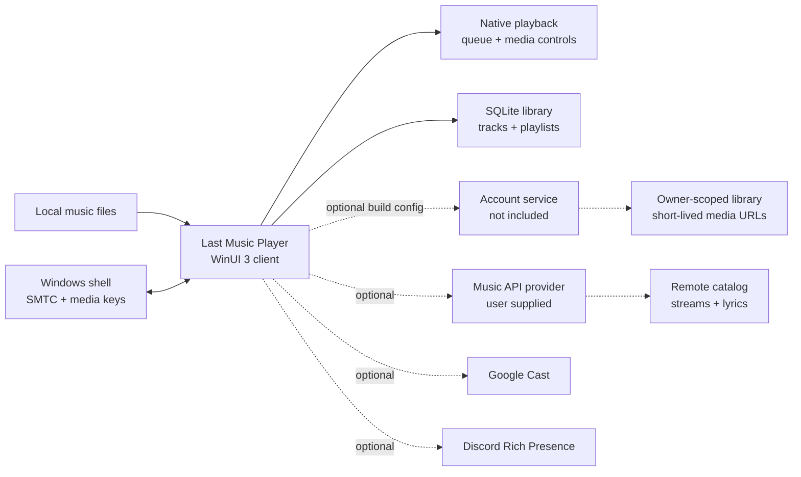

<div align="center">
  

  <h1>Last Music Player</h1>

  <p>
    <strong>A fast native Windows music player for local libraries, with optional remote playback through a build-configured account service or your own Music API.</strong>
  </p>

  <p>
    Offline playback comes first. Remote features stay behind either a private build configuration or a small provider contract you control.
  </p>

  <p>
    
    
    
    
    
    
  </p>

  <p>
    <a href="../../releases/latest">
      
    </a>
  </p>

  <p>
    <a href="#quick-start">Quick Start</a> -
    <a href="#features">Features</a> -
    <a href="#architecture">Architecture</a> -
    <a href="#music-api-provider">Music API Provider</a> -
    <a href="#account-integration">Account Integration</a> -
    <a href="#development">Development</a> -
    <a href="#license">License</a>
  </p>
</div>

<p align="center">
  
</p>

> [!NOTE]
> This repository ships the Windows client only. Without account-service build configuration or a user-configured Music API provider, Last Music Player remains a fully functional local music player; remote features simply stay unavailable.

## Quick Start

Requirements:

- Windows 10 2004+ or Windows 11
- Visual Studio 2022 with C++ desktop development tools
- Windows App SDK workload
- Windows 11 SDK

Build and run:

1. Open `Last Music Player.slnx` in Visual Studio.
2. Restore NuGet packages if Visual Studio does not do it automatically.
3. Build `x64` in `Debug` or `Release`.
4. Launch `Last_Music_Player.exe` from the build output.

The app is configured for self-contained deployment, so the Windows App SDK runtime DLLs ship beside the executable.

## Features

- Scan and play a local music library.
- Browse by songs, albums, artists, and genres.
- Build manual playlists and use auto-generated mixes.
- Queue tracks, play next, shuffle, repeat, and resume smoothly.
- Equalizer controls are visible but disabled while the audio effect is being refined.
- Show time-synced lyrics when a Music API provider is configured.
- Optionally synchronize an owner-scoped account library and playlists for offline browsing.
- Integrate with Windows media keys, SMTC, and the volume flyout.
- Use optional Discord Rich Presence and Google Cast output.
- Store the library locally in SQLite.

## Architecture



Project layout:

```text
App.xaml*                  App startup and shell wiring
MainWindow/                WinUI views, player UI, search, library, settings
Backend/                   Playback, database, account/provider clients, playlists
Frontend/                  Navigation and UI helpers
Assets/ Styles/ Resources/ Icons, themes, and app resources
ThirdParty/sqlite/         Vendored SQLite amalgamation
installer/                 Inno Setup packaging script
tests/native/              Native helper tests
```

## Music API Provider

Remote features are intentionally client-side only in this repository. Search, streaming, radio, lyrics, and link import expect an external provider that implements the small HTTP contract in [`PROVIDER_API.md`](PROVIDER_API.md).

To enable remote playback:

1. Run a provider that implements the documented endpoints.
2. Open **Settings -> Integrations** in the app.
3. Select **API key**, then enter the provider base URL and API key.

Your provider decides how identifiers are resolved, how auth works, and where audio comes from. The public client only knows the generic Music API contract.

## Account Integration

Account mode is optional and disabled in public builds by default. The public source leaves every account origin blank, so **Settings -> Integrations** reports that account integration is unavailable until a distributor supplies build-time configuration.

| MSBuild property | Requirement | Purpose |
| --- | --- | --- |
| `LastMusicAccountApiOrigin` | Required to enable account login | Browser authorization, session exchange, profile, synchronization, logout, and account catalog requests |
| `LastMusicAccountFrontendOrigin` | Optional | Enables the **Manage account** link. Omitting it does not disable login. |
| `LastMusicAccountMediaOrigin` | Optional | Trust boundary for signed stream and artwork URLs. It inherits the API origin when omitted. |

Use the validated build script for a configured build:

```powershell
.\tools\Build-WithAccountIntegration.ps1 `
    -ApiOrigin "https://api.account.example.test" `
    -FrontendOrigin "https://account.example.test" `
    -MediaOrigin "https://media.account.example.test" `
    -Configuration Release
```

Only the API origin is required:

```powershell
.\tools\Build-WithAccountIntegration.ps1 `
    -ApiOrigin "https://api.account.example.test" `
    -Configuration Release
```

A direct MSBuild invocation uses the same properties:

```powershell
& MSBuild.exe ".\Last Music Player.vcxproj" /t:Rebuild `
    /p:Configuration=Release /p:Platform=x64 `
    /p:LastMusicAccountApiOrigin=https://api.account.example.test `
    /p:LastMusicAccountFrontendOrigin=https://account.example.test `
    /p:LastMusicAccountMediaOrigin=https://media.account.example.test
```

Each value must be an absolute origin containing only a scheme, host, and optional port. A trailing `/` is allowed. Paths, query strings, fragments, user information, whitespace, quotes, and backslashes are rejected by the supported build script. Release builds require HTTPS. Debug builds additionally permit HTTP only for `localhost`, `127.0.0.1`, or `::1`, which supports local protocol testing without allowing public cleartext account traffic. Runtime validation remains authoritative and fails closed if a configured origin is unsafe.

The client uses the system browser with PKCE and an ephemeral loopback callback. Account sessions are stored in Windows Credential Manager, synchronized database rows are owner-scoped, and short-lived media URLs are not persisted. Authenticated account HTTP requests do not follow redirects, so service endpoints must respond directly rather than redirecting bearer-authenticated requests.

Account origins are embedded in the compiled binary and are not secrets. Never supply passwords, bearer tokens, API keys, signing keys, or other credentials as MSBuild properties. This repository includes no production origin, account-service implementation, private deployment configuration, or account credentials.

## Development

Useful commands:

```powershell
tools\Run-NativeProviderHelperTests.ps1
tools\Run-NativeAccountSyncTests.ps1
tools\Run-NativeAccountSyncTests.ps1 -Configuration Debug -ConfiguredMatrix
tools\Run-NativeAccountSyncTests.ps1 -Configuration Release -ConfiguredMatrix
```

The configured matrix rebuilds isolated blank, API-only, and full account variants with reserved test origins. It also verifies that invalid property combinations and unsafe build-script inputs are rejected.

For command-line builds, use the Visual Studio MSBuild toolchain and build the `x64` platform:

```powershell
MSBuild.exe "Last Music Player.vcxproj" /t:Build /p:Configuration=Release /p:Platform=x64
```

The release output is written to:

```text
x64/Release/Last_Music_Player.exe
```

## Optional Private Config

Some integrations use developer-specific IDs that are intentionally not committed. To enable them in your own builds, copy:

```text
Backend/AppSecrets.example.h
```

to:

```text
Backend/AppSecrets.local.h
```

Then fill in the values you need. The local file is gitignored.

Currently supported:

- `LMP_DISCORD_CLIENT_ID` - Discord application ID for Rich Presence. If omitted, Rich Presence is disabled.

## Packaging

An [Inno Setup](https://jrsoftware.org/isinfo.php) script is included under `installer/` for creating a single-file Windows installer.

## License

This project is **source available**, not open source. It is licensed under the
custom [Last Projects License 1.0](LICENSE).

- Installing or using a release also requires acceptance of the
  [Last Projects End-User Terms](TERMS.txt).
- Contributions require acceptance of the
  [Last Projects Individual Contributor License Agreement](CLA.md).
- Natural persons may use, study, build, and modify it for strictly personal,
  noncommercial purposes.
- Modified source must be published in a qualifying public repository within
  seven calendar days.
- Companies, employers, nonprofits, schools, government bodies, and every other
  organization require a separate written license.
- Commercial use, private derivatives, binary redistribution, and AI training
  or dataset use are not permitted without written permission.

Third-party components remain under their own terms, listed in
[`THIRD-PARTY-NOTICES.txt`](THIRD-PARTY-NOTICES.txt).

Commercial and organization licensing: **info@lastprojects.com**
